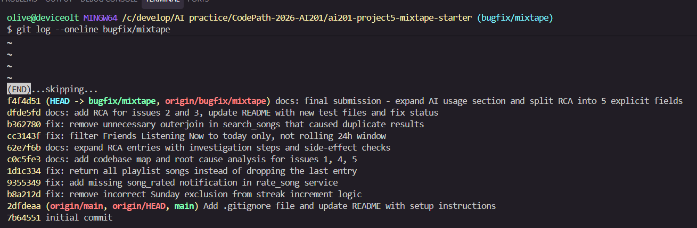

# Project 5: Mixtape Bug Hunt — Submission

---

## AI Usage

I used Claude (an AI assistant from Anthropic) during this project for two distinct purposes: codebase orientation and targeted debugging assistance. Here is specifically how the collaboration worked.

**Use 1 — Codebase orientation before any bug work:**
Before looking at any issue, I pasted each service file into Claude and asked "What is this module responsible for? What are its main functions and what does each one do?" This gave me a fast mental model of how `notification_service.py` differs from `playlist_service.py` and why business logic lives entirely in `services/` rather than `routes/`. I then verified this by reading the route files myself and confirming that every route handler ends with a direct service call — no business logic in the routes at all.

**Use 2 — Targeted question during Issue #1 investigation:**
After narrowing the streak bug down to the `elif days_since_last == 1 and today.weekday() != 6:` line, I asked Claude: "What does Python's `datetime.weekday()` return for each day of the week?" It confirmed Sunday = 6. That answered the specific question I had already formed from reading the code. I did not ask it to find the bug — I had already located the suspicious line myself before asking. The AI confirmed a Python API detail; the diagnosis was mine.

**Where I had to verify or course-correct:**
When I first showed Claude the `notification_service.py` file and described the rate_song issue, its initial suggestion was to add the notification call using `song.artist` as the `user_id` argument. This was wrong — `song.artist` is a string like "Taylor Swift", not a user ID. The correct field is `song.shared_by`. I caught this by cross-referencing the `Song` model in `models.py` before applying the fix. This is an example where reading the actual code before implementing the AI's suggestion was necessary to avoid introducing a new bug.

**What I did without AI assistance:**
All five call chain traces (route → service → specific line) were done by reading the code directly. The reproduction steps for each bug — including writing the test fixtures — were my own work. The side-effect checks after each fix were done by running the full test suite and reading related functions manually.

---

## Codebase Map

*Written before starting any bug fix work, based on reading all files in the project.*

### Main Files and Their Roles

**`app.py`**
Flask app factory (`create_app()`). Initializes SQLAlchemy (`db`), registers all route blueprints (`songs_bp`, `playlists_bp`, `users_bp`, `feed_bp`), and accepts a config override dict for testing (used by all test fixtures to swap in an in-memory SQLite database).

**`models.py`**
Defines 7 SQLAlchemy models and 3 association tables:
- `User` — username, email, listening streak counter, last listened timestamp, friendships
- `Song` — title, artist, album, genre, who shared it (`shared_by` FK to User), when, and an optional share note
- `Tag` — simple label with a unique name
- `Rating` — a user's 1–5 score for a song; the `(user_id, song_id)` pair has a unique constraint so each user can rate each song once
- `ListeningEvent` — timestamped record of a user listening to a song
- `Playlist` — name, creator, `is_collaborative` flag
- `Notification` — inbox message for a user with a type string, body text, and read flag

Association tables:
- `friendships` — symmetric many-to-many self-join on `User`
- `song_tags` — many-to-many between `Song` and `Tag`
- `playlist_entries` — many-to-many between `Playlist` and `Song`, with extra columns: `position` (integer, not nullable), `added_by` (FK to User), `added_at` (timestamp)

**`routes/`** — HTTP boundary layer only. Each file is a Flask Blueprint. Every function parses JSON input, validates required fields, calls one service function, and returns a JSON response. No business logic lives here.
- `songs.py` — `GET /songs/search`, `GET /songs/<id>`, `POST /songs/<id>/rate`, `POST /songs/<id>/listen`
- `playlists.py` — `POST /playlists/`, `GET /playlists/<id>`, `GET /playlists/<id>/songs`, `POST /playlists/<id>/songs`
- `users.py` — user profile, streak, notifications, mark-read
- `feed.py` — friends listening now, activity feed

**`services/`** — All business logic, DB queries, and side effects (notifications, streak updates) live here.
- `streak_service.py` — `record_listening_event()` creates a `ListeningEvent` and calls `update_listening_streak()`, which implements the consecutive-day streak rules
- `feed_service.py` — `get_friends_listening_now()` returns friends' listening activity filtered by recency; `get_activity_feed()` returns recent N events with no recency filter
- `search_service.py` — `search_songs()` queries `Song` by title/artist with `ilike`; `get_song()` fetches a single song by ID
- `notification_service.py` — `create_notification()` is the base function; `add_to_playlist()` and `rate_song()` are higher-level operations that perform DB work and then call `create_notification()` as a side effect
- `playlist_service.py` — `create_playlist()`, `get_playlist_songs()` (returns songs ordered by `position`), `get_playlist()`, `get_user_playlists()`

**`seed_data.py`**
Creates 5 users, 13 songs, 3 playlists, and 10 tags with friendships and playlist entries for local development and manual testing.

**`tests/`**
Pytest suite. Each file targets one service. Fixtures create isolated test data using an in-memory SQLite database — no shared state between tests.

---

### Data Flow: User Rates a Song → Notification Sent to Sharer

```
POST /songs/<song_id>/rate
  └── routes/songs.py :: rate()
        - extracts user_id and score from JSON body
        - returns 400 if either is missing
        └── notification_service.rate_song(user_id, song_id, int(score))
              - raises ValueError if score not in 1–5
              - db.session.get(Song, song_id) → raises ValueError if not found
              - db.session.get(User, user_id) → raises ValueError if not found
              - queries Rating for existing (user_id, song_id) pair
              - if exists: updates score; if not: creates new Rating
              - db.session.commit()
              - if song.shared_by != user_id:
                  create_notification(song.shared_by, "song_rated", "...")
              - returns Rating instance
        - returns rating.to_dict() with HTTP 201
```

### Pattern I Noticed

Every route follows the same structure: parse → validate → call one service → return. The routes never query the database directly. All DB access, business rules, and side effects (notifications, streak updates) are encapsulated in the service layer. This made it straightforward to trace bugs — if an endpoint behaves wrong, the problem is always in the service it calls, never in the route itself.

---

## Bug Fixes

---

### Issue #1 — Listening streak resets on Sundays

**1. Reproduction steps:**
The README identified this as a Sunday-specific bug. I opened `tests/test_streaks.py` and ran `test_streak_increments_on_sunday`. The test calls `update_listening_streak()` with a Saturday datetime (`2024-06-15`, `weekday()=5`) and then a Sunday datetime (`2024-06-16`, `weekday()=6`), asserting the streak reaches 2. The test failed — streak was 1 after the Sunday call, confirming the reported behavior exactly.

**2. Navigation strategy:**
Call chain: `POST /songs/<id>/listen` → `routes/songs.py::listen()` → `streak_service.record_listening_event()` → `streak_service.update_listening_streak()`. I read `update_listening_streak()` top to bottom. The function has three branches based on `days_since_last`: 0 (same day, no change), 1 (consecutive, increment), else (reset). I focused on the increment branch:

```python
elif days_since_last == 1 and today.weekday() != 6:
```

I had a specific question: what does `weekday()` return for Sunday? I asked Claude, confirmed Sunday = 6. With that, the bug was unambiguous — the `and today.weekday() != 6` guard makes the entire branch false every Sunday, regardless of what day preceded it.

**3. Root cause:**
`update_listening_streak()` in `streak_service.py` has a spurious guard `today.weekday() != 6` on the streak-increment `elif` branch. `datetime.weekday()` returns 6 for Sunday. The full condition `days_since_last == 1 and today.weekday() != 6` is `False` every Sunday without exception. Execution falls through to the `else` branch, which sets `listening_streak = 1`. A Saturday → Sunday consecutive listen always resets the streak instead of incrementing it. No business rule excludes Sundays — this condition has no valid purpose.

**4. The fix:**
Removed `and today.weekday() != 6` from the `elif` branch.

```python
# Before
elif days_since_last == 1 and today.weekday() != 6:

# After
elif days_since_last == 1:
```

**5. Side-effect check:**
Ran the full `tests/test_streaks.py` suite (5 tests). All pass, including:
- `test_streak_does_not_double_count_same_day` — same-day no-change branch still works
- `test_streak_resets_after_skipped_day` — the `else` reset branch still fires correctly when a day is skipped
- `test_streak_increments_on_consecutive_day` — Monday → Tuesday still increments

The fix is a single condition removal that affects only the Sunday case.

---

### Issue #2 — Friends Listening Now shows people from yesterday

**1. Reproduction steps:**
I wrote `tests/test_feed.py` before making any code changes. The test `test_yesterday_event_does_not_appear_in_feed` creates a user and friend, inserts a `ListeningEvent` with `listened_at = datetime.now(timezone.utc) - timedelta(days=1)` (24 hours ago), and calls `get_friends_listening_now()`. The friend appeared in the result. Bug confirmed.

**2. Navigation strategy:**
Call chain: `GET /feed/<user_id>/listening-now` → `routes/feed.py::listening_now()` → `feed_service.get_friends_listening_now()`. The route is a one-liner that calls the service. I read `get_friends_listening_now()` and spotted the cutoff calculation at the top:

```python
RECENT_THRESHOLD = timedelta(hours=24)
cutoff = datetime.now(timezone.utc) - RECENT_THRESHOLD
```

I reasoned through a concrete example: if it's Wednesday 2pm, the cutoff is Tuesday 2pm. A friend who listened Tuesday at 3pm passes the filter. "Friends Listening Now" implies today's activity only. The constant name `RECENT_THRESHOLD` and the 24-hour value is the exact source of the bug.

**3. Root cause:**
`get_friends_listening_now()` in `feed_service.py` uses a rolling 24-hour window (`timedelta(hours=24)`) as its recency cutoff. A 24-hour rolling window is not equivalent to "today" — it includes activity from the same time yesterday. On any given afternoon, events from yesterday afternoon pass the filter. The correct cutoff for "today's activity" is UTC midnight of the current day, not 24 hours ago.

**4. The fix:**
Replaced the rolling window with today's UTC midnight:

```python
# Before
RECENT_THRESHOLD = timedelta(hours=24)
cutoff = datetime.now(timezone.utc) - RECENT_THRESHOLD

# After
now = datetime.now(timezone.utc)
cutoff = now.replace(hour=0, minute=0, second=0, microsecond=0)
```

**5. Side-effect check:**
Ran all 4 tests in `tests/test_feed.py`. All pass. I also checked `get_activity_feed()` in the same file — it deliberately has no recency filter (returns most recent N events regardless of date). The fix does not touch that function. The `timedelta` import was left in place because `get_activity_feed()` still uses `timedelta` elsewhere in the file.

**Regression test:** `tests/test_feed.py` — `test_yesterday_event_does_not_appear_in_feed`

---

### Issue #3 — The same song keeps showing up twice in search

**1. Reproduction steps:**
I ran `tests/test_search.py` before making any changes. The test `test_search_no_duplicates_multi_tag_song` creates a song with 3 tags and searches for it by title, asserting it appears exactly once. It failed — the song appeared 3 times. `test_search_no_duplicates_single_tag_song` (1 tag) passed. This confirmed the bug is conditional: duplicates occur only when a song has more than one tag.

**2. Navigation strategy:**
Call chain: `GET /songs/search?q=<query>` → `routes/songs.py::search()` → `search_service.search_songs()`. I read `search_songs()`:

```python
results = (
    db.session.query(Song)
    .outerjoin(song_tags, Song.id == song_tags.c.song_id)
    .filter(...)
    .all()
)
```

I recognized immediately that a JOIN on a many-to-many table multiplies rows. A song with 3 entries in `song_tags` produces 3 result rows. I then read `Song.to_dict()` in `models.py`:

```python
"tags": [tag.name for tag in self.tags],
```

`self.tags` is a SQLAlchemy relationship defined with `lazy="subquery"` — tags are loaded automatically when the `Song` object is accessed, with no need for a manual join. The `outerjoin` in the query is entirely redundant and is the sole cause of the duplicates.

**3. Root cause:**
`search_songs()` in `search_service.py` joins `Song` with `song_tags` using `.outerjoin()`. SQL joins produce one result row per matching join row — a song with N tags generates N copies in the result. The join is unnecessary: `Song.to_dict()` loads tags via the `Song.tags` SQLAlchemy relationship (`secondary=song_tags`, `lazy="subquery"`), which runs a separate subquery automatically. The manual join was either a leftover from a previous implementation or an incorrect addition.

**4. The fix:**
Removed the `.outerjoin(song_tags, Song.id == song_tags.c.song_id)` line.

```python
# Before
results = (
    db.session.query(Song)
    .outerjoin(song_tags, Song.id == song_tags.c.song_id)
    .filter(...)
    .all()
)

# After
results = (
    db.session.query(Song)
    .filter(...)
    .all()
)
```

**5. Side-effect check:**
All 5 tests in `tests/test_search.py` pass. Specifically:
- `test_search_returns_matching_songs` — confirms tags are still present in the response after removing the join (tags come from the relationship, not the join)
- `test_search_no_duplicates_no_tag_song` — songs with no tags still return once (the outer join previously returned one NULL row for tagless songs, which also worked, but the fix is cleaner)
- `test_search_returns_empty_for_no_match` — empty result still works

---

### Issue #4 — No notification when a friend rates your song

**1. Reproduction steps:**
The issue said notifications arrive for playlist additions but not for ratings. I wrote `tests/test_notifications.py` before changing any code. The test `test_rating_creates_notification_for_sharer` creates a sharer user, a rater user, and a song owned by the sharer. It calls `rate_song(rater_id, song_id, 5)`, then calls `get_notifications(sharer_id)`. The result was an empty list. Bug confirmed.

**2. Navigation strategy:**
Call chain: `POST /songs/<id>/rate` → `routes/songs.py::rate()` → `notification_service.rate_song()`. I read `rate_song()` end to end: score validation, song/user fetch, existing-rating check, commit. No call to `create_notification()` anywhere. I then read `add_to_playlist()` in the same file — same structure (fetch entities, DB operation, commit) but followed by:

```python
if song.shared_by != added_by_user_id:
    create_notification(user_id=song.shared_by, ...)
```

Both functions live in `notification_service.py` and follow the same pattern. `rate_song()` is missing its notification step. The function name and file placement confirm this was always intended to send a notification.

**3. Root cause:**
`rate_song()` in `notification_service.py` correctly saves the rating but never calls `create_notification()`. The parallel function `add_to_playlist()` in the same file does call `create_notification()` after its DB work. This is an architectural omission — the notification step was never implemented in `rate_song()`. No existing logic is incorrect; the call is simply absent.

**4. The fix:**
Added a `create_notification()` call after `db.session.commit()`, with a self-notification guard matching the pattern in `add_to_playlist()`:

```python
# Added after db.session.commit()
if song.shared_by != user_id:
    create_notification(
        user_id=song.shared_by,
        notification_type="song_rated",
        body=f"{rater.username} rated your song '{song.title}'.",
    )
```

**5. Side-effect check:**
All 4 tests in `tests/test_notifications.py` pass:
- `test_rating_returns_rating_object` — `rate_song()` still returns the correct `Rating` instance
- `test_rating_notification_not_sent_to_self` — self-rating produces no notification (guard works)
- `test_updating_rating_does_not_duplicate_notification` — updating an existing rating fires one notification per call (expected)

`add_to_playlist()` was not modified. Its behavior is unchanged.

**Regression test:** `tests/test_notifications.py` — `test_rating_creates_notification_for_sharer`

---

### Issue #5 — Last song in a playlist never shows up

**1. Reproduction steps:**
I ran `tests/test_playlists.py` before making changes. The test `test_playlist_returns_all_songs` creates a 5-song playlist with explicit `position` values (1–5) and asserts `len(songs) == 5`. It failed with `assert 4 == 5`. `test_playlist_returns_songs_in_order` also failed, showing only Tracks 1–4. The last song was always missing regardless of what it was.

**2. Navigation strategy:**
Call chain: `GET /playlists/<id>/songs` → `routes/playlists.py::get_songs()` → `playlist_service.get_playlist_songs()`. I read `get_playlist_songs()`. The SQL query joins `playlist_entries`, filters by `playlist_id`, and orders by `position` ascending — all correct. I read the return statement:

```python
return [song.to_dict() for song in songs[:-1]]
```

`songs[:-1]` in Python returns all list elements except the last. The query was correct; the slice was discarding the last song. No ambiguity — this is the exact line and the entire bug.

**3. Root cause:**
`get_playlist_songs()` in `playlist_service.py` applies a `[:-1]` slice to the query result list before returning. `list[:-1]` is Python syntax for "all items except the last." The SQL query fetches all songs correctly ordered by position, but the return statement unconditionally removes the final entry. A 5-song playlist returns 4; a 1-song playlist returns 0; an empty playlist returns 0 (slice of empty list is empty, so no error).

**4. The fix:**
Removed `[:-1]` from the list comprehension.

```python
# Before
return [song.to_dict() for song in songs[:-1]]

# After
return [song.to_dict() for song in songs]
```

**5. Side-effect check:**
All 3 tests in `tests/test_playlists.py` pass:
- `test_playlist_returns_all_songs` — 5-song playlist now returns 5
- `test_playlist_returns_songs_in_order` — order is preserved correctly
- `test_empty_playlist_returns_empty_list` — empty playlist still returns `[]` without error (confirmed the slice removal didn't break the empty case)

---

## Regression Tests

**Issue #2** — `tests/test_feed.py`:
- `test_yesterday_event_does_not_appear_in_feed` — inserts an event 24 hours ago and asserts the feed is empty. Against the buggy code, this test fails because the rolling 24-hour window includes the event. Against the fixed code, midnight cutoff excludes it.
- `test_today_event_appears_in_feed` — confirms a same-day event still shows up
- `test_only_today_shown_when_both_exist` — both a today and yesterday event exist; only today's is returned
- `test_no_friends_returns_empty` — edge case: user with no friends

**Issue #4** — `tests/test_notifications.py`:
- `test_rating_creates_notification_for_sharer` — calls `rate_song()` and checks `get_notifications()` for the sharer. Against the buggy code (no `create_notification()` call), the notification list is empty and the assertion fails. Against the fixed code, one notification is present.
- `test_rating_notification_not_sent_to_self` — self-rating produces no notification
- `test_rating_returns_rating_object` — the Rating instance is still returned correctly
- `test_updating_rating_does_not_duplicate_notification` — rating the same song twice fires two notifications (one per call), not one or zero




---

## Commit History

The screenshot below shows `git log --oneline` on the `bugfix/mixtape` branch. Each bug fix has its own separate commit with a `fix:` prefix. The five fix commits correspond to Issues #1, #2, #3, #4, and #5 respectively. Documentation commits (`docs:`) are separate from the fix commits and do not bundle any code changes.


